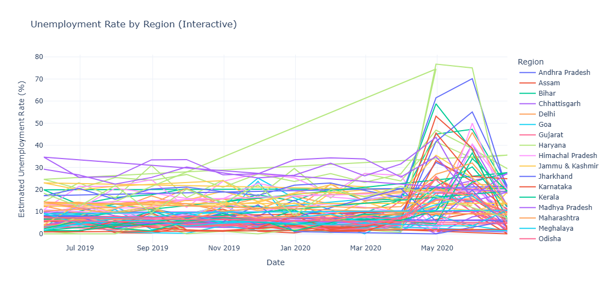

# 📊 Unemployment Analysis in India Using Python

This project focuses on analyzing the unemployment rate in India using Python. It investigates the effect of **COVID-19**, explores seasonal and regional trends, and presents visual insights using powerful Python libraries.

---

## 🎯 Task Objectives

✔️ Analyze unemployment data from different regions of India  
✔️ Investigate the **impact of COVID-19** on unemployment  
✔️ Identify **seasonal and regional** trends using EDA  
✔️ Visualize findings using **Matplotlib**, **Seaborn**, and **Plotly**  
✔️ Present data-driven insights for economic or social policy

---

## 📘 Dataset Overview

- **File**: `Unemp_India.csv`
- **Features**:
  - `Region`: Name of the state or union territory
  - `Date`: Time (monthly)
  - `Estimated Unemployment Rate (%)`: Unemployment percentage

The data spans multiple months and regions, enabling both time-series and regional analysis.

- Dataset Link: `https://www.kaggle.com/datasets/gokulrajkmv/unemployment-in-india`

---

## 🚀 Project Workflow

1. Import necessary libraries and load dataset  
2. Clean and preprocess the data  
3. Perform exploratory data analysis (EDA)  
4. Visualize:
   - Monthly unemployment trends
   - Regional unemployment patterns
   - COVID-19 impact on unemployment
5. Derive insights and conclusions

---

## 📊 Exploratory Data Analysis

### Monthly Variation in Unemployment Rate (All Years)

Boxplot showing how unemployment varies by month, with noticeable spikes in **April** and **May**.

  

---

### Unemployment Rate by Region (Interactive)

Line plot for state-wise unemployment. A sharp increase is visible around **April–May 2020**, likely due to the lockdown.

  

---

### National Trend Over Time

Shows India's overall unemployment trend, with a steep spike during the pandemic.

  

---

## 📌 Key Insights

- 📈 Unemployment **spiked to ~25–30%** in April-May 2020 due to COVID-19
- 📅 April consistently shows higher unemployment — likely a seasonal effect
- 🌍 Some states were **more affected** than others (e.g., Delhi, Haryana)
- 🧾 Recovery began post mid-2020, but not uniformly across all regions

---

